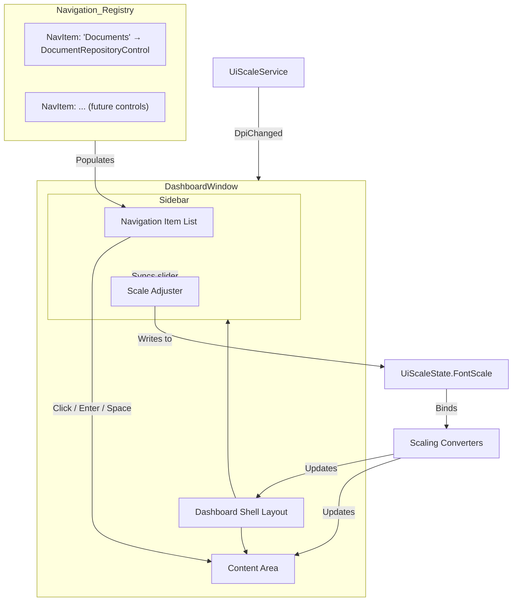
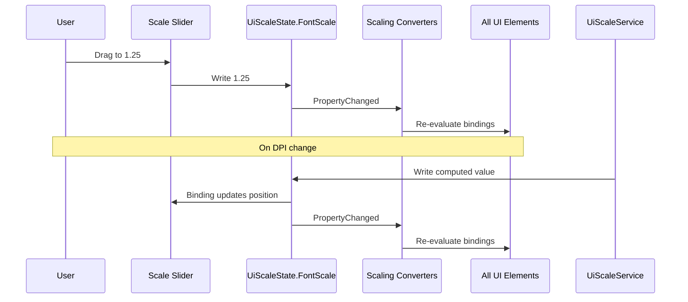

# Design Document — Dashboard Shell

## Overview

The Dashboard Shell replaces the current bare `ContentControl` layout in `DashboardWindow` with a two-panel shell: a fixed-width sidebar on the left for navigation and scale adjustment, and a content area on the right that swaps the active `UserControl` based on the selected navigation item.

The shell is implemented entirely in `DashboardWindow.xaml` / `DashboardWindow.xaml.cs` using the existing code-behind pattern. Navigation items are stored in a `Navigation_Registry` — a `List<NavItem>` of records, each containing a display label and a `Func<UserControl>` factory. The sidebar is data-driven from this list, so adding a new section requires only a single registry entry.

A Scale_Adjuster at the bottom of the sidebar lets the user override the automatic DPI-based scale by writing directly to `UiScaleState.FontScale`. Preset buttons (75%, 100%, 125%, 150%) and a slider (0.6–1.8) provide quick and fine-grained control. When `UiScaleService.DpiChanged` fires, the slider syncs to the new automatic value.

All dimensions use the existing scaling converters (`FontScaleConverter`, `LayoutScaleConverter`, `ThicknessScaleConverter`) bound to `UiScaleState.FontScale`. Keyboard accessibility follows the focus ring pattern from the steering document.

## Architecture



The architecture is intentionally flat — no new services, no MVVM framework, no DI container. `DashboardWindow.xaml.cs` owns the navigation registry, builds the sidebar from it, handles click/keyboard events, and swaps the `ContentArea.Content`. This matches the existing code-behind pattern used by `DocumentRepositoryControl` and its children.

### Key Design Decisions

1. **Shell lives in DashboardWindow, not a separate UserControl.** The shell is the window's layout — extracting it into a child control would add indirection without benefit. `DashboardWindow.xaml` defines the two-column Grid; `DashboardWindow.xaml.cs` owns the registry and navigation logic.

2. **Navigation registry is a `List<NavItem>` in code-behind.** A simple list of records is the minimal extensible structure. No interface, no plugin system — just add a line to the list. The `Func<UserControl>` factory allows each entry to pass constructor parameters (including `Action` callbacks for dialog hosting) at creation time.

3. **Scale_Adjuster writes directly to `UiScaleState.FontScale`.** This bypasses `UiScaleService.InitializeFromWindow` so the user's manual choice takes effect immediately. When `DpiChanged` fires, the handler re-reads the service's computed value and updates the slider, which in turn writes to `UiScaleState.FontScale`.

4. **Sidebar navigation items are `Button` elements styled to look like nav links.** Using `Button` gives us built-in keyboard focus, Tab navigation, Enter/Space activation, and the ability to apply the focus ring template — all without custom focusable controls.

5. **Content_Root_Border is applied per-control, not by the shell.** Each main `UserControl` wraps itself in the Content_Root_Border (as the steering document requires). The shell's `ContentArea` is a plain `ContentControl` — it does not add its own border around the loaded control.

## Components and Interfaces

### NavItem Record

Defined in `DashboardWindow.xaml.cs`:

```csharp
public record NavItem(string Label, Func<UserControl> Factory);
```

- `Label`: Display text shown in the sidebar (e.g., "Documents").
- `Factory`: Creates the `UserControl` instance with all required constructor parameters. Called each time the user navigates to this item.

### DashboardWindow (modified)

**XAML structure:**

```
Window
└── Grid (2 columns: Auto sidebar, * content)
    ├── Border (Sidebar)
    │   └── DockPanel
    │       ├── StackPanel (top: app title / branding area)
    │       ├── ItemsControl (middle: nav buttons, DockPanel.Dock=Top)
    │       └── StackPanel (bottom: Scale_Adjuster, DockPanel.Dock=Bottom)
    └── ContentControl x:Name="ContentArea"
```

**Code-behind responsibilities:**

| Method / Field | Purpose |
|---|---|
| `_navItems` (`List<NavItem>`) | The navigation registry |
| `_selectedIndex` (`int`) | Tracks which nav item is active |
| `NavigateTo(int index)` | Calls the factory, sets `ContentArea.Content`, updates selected visual state |
| `NavButton_Click` | Resolves index from `Tag`, calls `NavigateTo` |
| `ShowUploadDialog(Action<DocumentModel>)` | Existing dialog hosting logic (unchanged) |
| `OnDpiChanged()` | Reads `UiScaleService.FontScale`, updates slider |
| `ScaleSlider_ValueChanged` | Writes `slider.Value` to `UiScaleState.FontScale` |
| `PresetButton_Click` | Sets slider value to preset (0.75, 1.0, 1.25, 1.5) |

### Scale_Adjuster (inline in Sidebar)

Not a separate `UserControl` — it's a `StackPanel` at the bottom of the sidebar containing:

- A `TextBlock` showing the current percentage (e.g., "100%")
- A `Slider` (Min=0.6, Max=1.8, TickFrequency=0.05)
- A horizontal `StackPanel` of four preset `Button` elements (75%, 100%, 125%, 150%)

The slider's `Value` is two-way bound to a code-behind property or directly manipulated in event handlers. When the slider value changes, the handler writes to `UiScaleState.FontScale` via the application resource.

### Sidebar Navigation Button Style

Defined inline in `DashboardWindow.xaml` `<Window.Resources>`:

```
Style x:Key="NavButtonStyle" TargetType="Button"
├── Background: Transparent (default), #EFF6FF (selected), #F3F4F6 (hover)
├── Foreground: #374151 (default), #1D4ED8 (selected)
├── FontWeight: Normal (default), SemiBold (selected)
├── CornerRadius: 6
├── Padding: scaled via ThicknessScaleConverter '10,8,10,8'
├── HorizontalContentAlignment: Left
├── FocusVisualStyle: {x:Null}
└── Focus ring borders (FocusOuterRing, FocusInnerRing) visible on IsKeyboardFocused
```

Selected state is toggled by setting a `Tag` or by programmatically updating the button's style trigger. The simplest approach: each nav button stores its index in `Tag`, and `NavigateTo` iterates the buttons to set/clear a "selected" visual state class.

### Preset Button Style

Small secondary-style buttons with scaled font size and padding. They reuse `VcSecondaryButtonStyle` or a lightweight variant defined inline.

## Data Models

### NavItem

```csharp
public record NavItem(string Label, Func<UserControl> Factory);
```

This is the only new data type. All other models (`DocumentModel`, `SummaryCardData`, etc.) remain unchanged in their respective control code-behinds.

### Navigation Registry (initial contents)

```csharp
_navItems = new List<NavItem>
{
    new NavItem("Documents", () => new DocumentRepositoryControl(
        onRequestUploadDialog: ShowUploadDialog
    )),
    // Future entries added here
};
```

### Scale State Flow




## Correctness Properties

*A property is a characteristic or behavior that should hold true across all valid executions of a system — essentially, a formal statement about what the system should do. Properties serve as the bridge between human-readable specifications and machine-verifiable correctness guarantees.*

### Property 1: Navigation item count matches registry

*For any* list of `NavItem` records used as the navigation registry, the number of navigation buttons rendered in the sidebar shall equal the length of that list.

**Validates: Requirements 2.1**

### Property 2: Navigation activation sets content to factory result

*For any* `NavItem` in the navigation registry, activating that item (via click, Enter, or Space) shall cause `ContentArea.Content` to be the `UserControl` instance returned by that item's `Factory` delegate.

**Validates: Requirements 3.1, 7.3**

### Property 3: Scale value round-trip with clamping

*For any* double value written to the Scale_Adjuster slider, the resulting `UiScaleState.FontScale` shall equal that value clamped to the range [0.6, 1.8], and reading `UiScaleState.FontScale` back shall return the same clamped value.

**Validates: Requirements 5.2, 5.3**

### Property 4: Percentage label formatting

*For any* `UiScaleState.FontScale` value in [0.6, 1.8], the Scale_Adjuster percentage label shall display the string `Math.Round(value * 100) + "%"`.

**Validates: Requirements 5.4**

## Error Handling

| Scenario | Handling |
|---|---|
| `NavItem.Factory` throws an exception | Catch the exception in `NavigateTo`, leave `ContentArea.Content` unchanged, and write a diagnostic via `Debug.Print`. Do not crash the application. |
| `NavItem.Factory` returns `null` | Treat as a failed navigation — leave `ContentArea.Content` unchanged and log a warning. |
| Navigation registry is empty | Display an empty sidebar. `ContentArea` remains blank (no crash). The Scale_Adjuster still functions. |
| Slider value set programmatically outside [0.6, 1.8] | The `Slider.Minimum` and `Slider.Maximum` properties enforce clamping at the WPF control level. No additional code needed. |
| `UiScaleState` resource missing from application resources | `UiScaleRead` fallback chain handles this — converters fall back to `UiScaleService.FontScale` → `1.0`. The slider handler should guard against a null `UiScaleState` resource. |
| `DpiChanged` fires before window is fully loaded | `UiScaleService.InitializeFromWindow` already handles this gracefully. The slider sync handler should check that the slider is loaded before updating. |
| Dialog hosting callback invoked after window is closed | The `ShowUploadDialog` method checks `dialogWindow` lifecycle. No change needed from current implementation. |

## Testing Strategy

### Unit Tests

Unit tests cover specific examples, edge cases, and integration points:

- **Default navigation**: On load, `ContentArea.Content` is the control from the first registry entry ("Documents" → `DocumentRepositoryControl`).
- **Preset buttons**: Clicking 75% sets `FontScale` to 0.75; clicking 100% sets 1.0; clicking 125% sets 1.25; clicking 150% sets 1.5.
- **DPI change sync**: When `UiScaleService.DpiChanged` fires, the slider position updates to the new `UiScaleService.FontScale` value.
- **Slider initialization**: On load, the slider value equals the current `UiScaleState.FontScale`.
- **Registry contains "Documents"**: The navigation registry includes an entry with label "Documents" whose factory produces a `DocumentRepositoryControl`.
- **Dialog hosting callback**: `DocumentRepositoryControl` receives a working `onRequestUploadDialog` callback that creates a modal window.
- **Factory exception handling**: If a factory throws, `ContentArea.Content` remains unchanged.
- **Empty registry**: With zero nav items, the sidebar renders no buttons and the content area is empty.

### Property-Based Tests

Property-based tests validate universal properties across generated inputs. Use **FsCheck** (via the `FsCheck.Xunit` NuGet package) as the property-based testing library for .NET 8.

Each property test must:
- Run a minimum of 100 iterations
- Reference its design document property in a comment tag
- Use the format: `// Feature: dashboard-shell, Property {N}: {title}`

| Property | Generator Strategy | Assertion |
|---|---|---|
| **Property 1**: Nav item count matches registry | Generate random lists of `NavItem` records (0–20 items, random labels, stub factories returning empty `UserControl`). | Count of rendered nav buttons == list length. |
| **Property 2**: Navigation activation sets content to factory result | Generate a random registry (1–10 items), pick a random index. | After `NavigateTo(index)`, `ContentArea.Content` is reference-equal to the `UserControl` returned by `_navItems[index].Factory()`. |
| **Property 3**: Scale value round-trip with clamping | Generate random doubles in [-1.0, 3.0] (wider than valid range to test clamping). | After writing to slider, `UiScaleState.FontScale` equals `Clamp(value, 0.6, 1.8)`. |
| **Property 4**: Percentage label formatting | Generate random doubles in [0.6, 1.8]. | Label text equals `$"{Math.Round(value * 100)}%"`. |

### Test Configuration

- **Framework**: xUnit + FsCheck.Xunit
- **Minimum iterations**: 100 per property (set via `MaxTest = 100` on `[Property]` attribute)
- **UI thread**: Property tests that touch WPF controls must run on an STA thread. Use `[STAFact]` or a custom `SynchronizationContext` for xUnit.
- **Tag format**: `// Feature: dashboard-shell, Property {N}: {title}`
