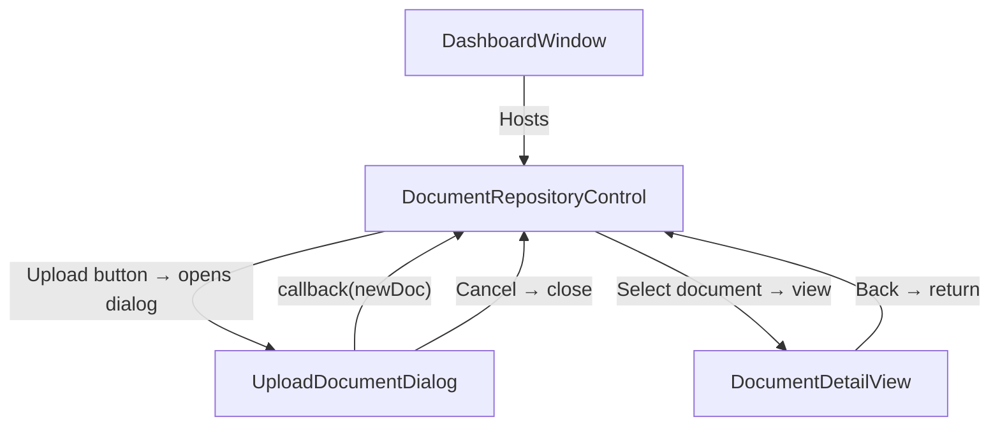

# Design Document: WPF UserControl Framework

## Overview

This design describes a .NET 8 WPF solution structured as a user control testing framework. The framework provides a host application (`MainWindow`) that can display and navigate between user controls, each built with co-located `.xaml` and `.xaml.cs` files. A shared `ResourceDictionary` (`PeoplePosTheme.xaml`) provides the common visual language — colors, brushes, converters, control templates, and focus ring patterns. Data flows between parent and child controls via constructor injection (parent → child) and callbacks (child → parent). Each control's code-behind contains its own models, constants, and demo data — there are no separate `Models/` or `DemoData/` folders. Demo data is hard-coded per control so the framework runs standalone without a backend.

The first two controls are:
1. **Document Repository** — summary cards + scrollable document list with category badges
2. **Upload Document Dialog** — form-based popup with validation, file selector area, and parent notification

A **Document Detail View** is also included for viewing a selected document's full information.

A **Steering Document** (markdown) captures all conventions so future contributors can add controls consistently.

## Architecture

### Solution Layout

```
WpfUserControlFramework/
├── WpfUserControlFramework.sln
├── WpfUserControlFramework/
│   ├── WpfUserControlFramework.csproj          # .NET 8, WPF app
│   ├── App.xaml / App.xaml.cs                   # Merges PeoplePosTheme.xaml, global font + layout constants
│   ├── DashboardWindow.xaml / DashboardWindow.xaml.cs  # Host shell (StartupUri), navigation
│   ├── PeoplePosTheme.xaml                      # Shared ResourceDictionary (project root)
│   ├── Controls/
│   │   ├── DocumentRepository/
│   │   │   ├── DocumentRepositoryControl.xaml
│   │   │   └── DocumentRepositoryControl.xaml.cs  # Contains DocumentModel, DocumentCategories, SummaryCardData, demo data, and all control logic
│   │   ├── UploadDocumentDialog/
│   │   │   ├── UploadDocumentDialog.xaml
│   │   │   └── UploadDocumentDialog.xaml.cs       # Contains ValidationResult and upload form logic
│   │   └── DocumentDetailView/
│   │       ├── DocumentDetailView.xaml
│   │       └── DocumentDetailView.xaml.cs         # Contains detail display logic
│   └── Docs/
│       └── SteeringDocument.md                  # Conventions reference
└── WpfUserControlFramework.Tests/
    ├── WpfUserControlFramework.Tests.csproj     # xUnit + FsCheck
    └── ...
```

> **Convention:** There are no separate `Models/` or `DemoData/` folders. Each user control's code-behind file contains its own models, constants, demo data, and helper types. This keeps everything self-contained — when you look at a control's `.xaml.cs`, you see the full picture: data shape, sample data, and behavior.

### Key Architectural Decisions

| Decision | Rationale |
|---|---|
| Code-behind (no MVVM) | Requirements specify co-located .xaml/.xaml.cs pairs with constructor injection. MVVM would add indirection not needed for a testing framework. |
| Constructor injection for data passing | Explicit parameter declaration makes data dependencies visible. No service locator or DI container needed. |
| Callbacks via `Action<T>` delegates | Child controls accept an `Action<DocumentModel>` (or similar) in their constructor to push results back to the parent. Simple, testable, no event bus. |
| Single shared ResourceDictionary | `PeoplePosTheme.xaml` at project root, merged at `App.xaml` level gives all controls access. No per-control merging needed. |
| Inline styles for control-specific needs | Each control's `<UserControl.Resources>` section holds styles that don't belong in the shared dictionary. |
| Models and demo data in code-behind | Each control's `.xaml.cs` file contains its own model classes, constants, and static demo data. No separate `Models/` or `DemoData/` folders. This keeps each control fully self-contained. |

### Navigation Flow



`DashboardWindow` acts as the shell. It instantiates `DocumentRepositoryControl` and sets it as its content. When the repository needs to show a dialog or detail view, it either opens a `Window` containing the child control (for dialogs) or swaps the content area (for detail views).

### Dialog Hosting Pattern

`UploadDocumentDialog` is a `UserControl` hosted inside a `Window` created programmatically by the parent:

```csharp
var dialog = new UploadDocumentDialog(
    categories: new[] { "Compliance", "Legal", "Banking" },
    onDocumentUploaded: newDoc => { /* add to list */ }
);
var window = new Window
{
    Content = dialog,
    SizeToContent = SizeToContent.WidthAndHeight,
    WindowStartupLocation = WindowStartupLocation.CenterOwner,
    Owner = Window.GetWindow(this)
};
window.ShowDialog();
```

This keeps the dialog as a reusable `UserControl` while getting modal behavior from the `Window`.

## Components and Interfaces

### 1. App (App.xaml / App.xaml.cs)

**Responsibility:** Application entry point. Merges `PeoplePosTheme.xaml` into application-level resources and defines global font, layout constants, and base sizing values.

```xml
<Application x:Class="RestaurantPosWpf.App"
             xmlns="http://schemas.microsoft.com/winfx/2006/xaml/presentation"
             xmlns:x="http://schemas.microsoft.com/winfx/2006/xaml"
             xmlns:local="clr-namespace:RestaurantPosWpf"
             xmlns:sys="clr-namespace:System;assembly=mscorlib"
             StartupUri="DashboardWindow.xaml">
    <Application.Resources>
        <ResourceDictionary>
            <ResourceDictionary.MergedDictionaries>
                <ResourceDictionary Source="PeoplePosTheme.xaml" />
            </ResourceDictionary.MergedDictionaries>

            <sys:Double x:Key="UiFontScale">1.0</sys:Double>

            <!-- Global font family -->
            <Style TargetType="{x:Type TextBlock}">
                <Setter Property="FontFamily" Value="Segoe UI" />
            </Style>
            <Style TargetType="{x:Type Control}">
                <Setter Property="FontFamily" Value="Segoe UI" />
            </Style>

            <!-- Base layout constants -->
            <sys:Double x:Key="BaseNavWidth">250</sys:Double>
            <sys:Double x:Key="BaseNavHandleWidth">10</sys:Double>
            <sys:Double x:Key="BaseButtonHeight">42</sys:Double>
            <sys:Double x:Key="BaseButtonCornerRadius">8</sys:Double>
            <sys:Double x:Key="BaseControlGap">12</sys:Double>
            <sys:Double x:Key="BasePaddingSmall">4</sys:Double>
            <sys:Double x:Key="BasePaddingMedium">8</sys:Double>
            <sys:Double x:Key="BasePaddingLarge">12</sys:Double>
            <sys:Double x:Key="BaseTextBoxHeight">34</sys:Double>
            <sys:Double x:Key="BaseHeaderHeight">85</sys:Double>
            <sys:Double x:Key="BaseHeaderLeftWidth">260</sys:Double>
            <sys:Double x:Key="BaseHeaderHeightPlusOne">86</sys:Double>
        </ResourceDictionary>
    </Application.Resources>
</Application>
```

**Key points:**
- `PeoplePosTheme.xaml` is merged at root level (not in a `Themes/` subfolder)
- `StartupUri` points to `DashboardWindow.xaml` (the host shell)
- Global `FontFamily` is set via implicit styles on both `TextBlock` and `Control`
- Base layout constants (`BaseButtonHeight`, `BaseControlGap`, padding values, etc.) are defined as `sys:Double` resources for consistent sizing across all controls

### 2. DashboardWindow (DashboardWindow.xaml / DashboardWindow.xaml.cs)

**Responsibility:** Host shell (StartupUri). Displays the current active control in a `ContentControl`.

```csharp
public partial class DashboardWindow : Window
{
    public DashboardWindow()
    {
        InitializeComponent();
        ContentArea.Content = new DocumentRepositoryControl(
            onNavigateToDetail: ShowDocumentDetail,
            onRequestUploadDialog: ShowUploadDialog
        );
    }

    private void ShowDocumentDetail(DocumentModel document) { /* swap content */ }
    private void ShowUploadDialog(Action<DocumentModel> onUploaded) { /* open modal */ }
}
```

### 3. DocumentRepositoryControl

**Responsibility:** Displays summary cards and a scrollable document list. Initiates navigation to detail view and upload dialog. Contains all models, constants, and demo data for the document domain.

**Code-behind contains:**
- `DocumentModel` class — data shape for a document
- `DocumentCategories` static class — category constants and list
- `SummaryCardData` record — computed summary card data
- Static demo data method returning sample `List<DocumentModel>`
- All control logic (summary computation, list management, navigation callbacks)

**Constructor Parameters:**
- `Action<DocumentModel> onNavigateToDetail` — callback to request detail view
- `Action<Action<DocumentModel>> onRequestUploadDialog` — callback to request upload dialog, passing a sub-callback for receiving the new document

**Key Elements:**
- 4 summary cards (Total, Compliance, Legal, Banking) with counts computed from the document list
- Scrollable list with columns: Name, Category (badge), File Type, Size, Upload Date
- "Upload Document" button (VcPrimaryButtonStyle)

### 4. UploadDocumentDialog

**Responsibility:** Form for creating a new document entry. Validates input and returns data via callback.

**Code-behind contains:**
- `ValidationResult` record — validation outcome for form fields
- All form logic (validation, file selection simulation, callback invocation)

**Constructor Parameters:**
- `IEnumerable<string> categories` — available category options
- `Action<DocumentModel> onDocumentUploaded` — callback to return the new document
- `Action onCancel` — callback to close without returning data

**Key Elements:**
- Document Name field (IcEnabledTextBoxStyle)
- Category dropdown (IcEnabledComboBoxStyle)
- File selector area (drag-and-drop visual, simulated selection)
- Notes field (IcEnabledTextBoxStyle, multiline)
- Cancel button (VcSecondaryButtonStyle), Upload button (VcPrimaryButtonStyle)
- Validation: Document Name required; shows inline error message

### 5. DocumentDetailView

**Responsibility:** Displays full details of a selected document.

**Constructor Parameters:**
- `DocumentModel document` — the document to display
- `Action onBack` — callback to return to the repository list

**Key Elements:**
- Read-only display of: Name, Category, File Type, Size, Upload Date, Notes
- Back button (VcSecondaryButtonStyle)

### 6. PeoplePosTheme.xaml (Shared ResourceDictionary — project root)

**Responsibility:** Single source of truth for visual styling. Lives at the project root (not in a subfolder), merged via `App.xaml`.

**Contents:**
- **Colors/Brushes:** MainForeground (#111827), DimmedForeground (#687280), FocusInner (#93C5FD), FocusOuter (#C1DEFE), category badge colors
- **Converters:** `WidthMultiplierConverter`, `FontScaleConverter`, `LayoutScaleConverter`, `ThicknessScaleConverter`, `CornerRadiusFromHeightConverter`, `ScaledDoubleConverter`
- **UiScaleState:** Binding source for root border scaling
- **Control Styles:** `VcPrimaryButtonStyle`, `VcSecondaryButtonStyle`, `IcEnabledComboBoxStyle`, `IcEnabledTextBoxStyle`, `IcBaseTextBoxStyle`, `IcBaseComboBoxStyle`
- **Focus Ring Template:** A `ControlTemplate` or style trigger that renders the two-border focus ring (inner #93C5FD, outer #C1DEFE) on keyboard focus

### 7. SteeringDocument.md

**Responsibility:** Markdown reference describing all conventions. Covers:
- Shared stylesheet usage (how to reference styles, when to use inline styles)
- Focus ring pattern (inner/outer colors, when to apply)
- Root border pattern (UiScaleState bindings, Border structure)
- Parent-child data passing (constructor injection, Action callbacks)
- Style reference table (style keys, target types, usage)
- Inline stylesheet convention
- Models and demo data convention (all models, constants, and demo data live in the owning control's code-behind — no separate Models/ or DemoData/ folders)


## Data Models

> All models, constants, records, and demo data below reside inside the code-behind (`.xaml.cs`) of the control that owns them. There are no separate model or demo data files.

### DocumentModel (in DocumentRepositoryControl.xaml.cs)

```csharp
public class DocumentModel
{
    public string Id { get; set; } = Guid.NewGuid().ToString();
    public string Name { get; set; } = string.Empty;
    public string Category { get; set; } = string.Empty;   // "Compliance", "Legal", "Banking"
    public string FileType { get; set; } = string.Empty;    // "PDF", "DOCX", "XLSX", etc.
    public long FileSize { get; set; }                       // bytes
    public DateTime UploadDate { get; set; } = DateTime.Now;
    public string Notes { get; set; } = string.Empty;
    public string FileName { get; set; } = string.Empty;     // original file name from selector
}
```

### Category Constants (in DocumentRepositoryControl.xaml.cs)

```csharp
public static class DocumentCategories
{
    public const string Compliance = "Compliance";
    public const string Legal = "Legal";
    public const string Banking = "Banking";

    public static readonly IReadOnlyList<string> All = new[] { Compliance, Legal, Banking };
}
```

### Summary Card Data (in DocumentRepositoryControl.xaml.cs)

Summary cards are computed from the document list, not stored separately:

```csharp
public record SummaryCardData(string Title, int Count, string ColorKey);
```

Computed at runtime:
```csharp
private List<SummaryCardData> ComputeSummaries(List<DocumentModel> documents) => new()
{
    new("Total Documents", documents.Count, "TotalColor"),
    new("Compliance", documents.Count(d => d.Category == DocumentCategories.Compliance), "ComplianceColor"),
    new("Legal", documents.Count(d => d.Category == DocumentCategories.Legal), "LegalColor"),
    new("Banking", documents.Count(d => d.Category == DocumentCategories.Banking), "BankingColor"),
};
```

### Validation Result (in UploadDocumentDialog.xaml.cs)

```csharp
public record ValidationResult(bool IsValid, string ErrorMessage = "");
```

Used by `UploadDocumentDialog` to validate form fields before submission.

### Demo Data (in DocumentRepositoryControl.xaml.cs)

Demo data is a static method inside the control's code-behind, not a separate class:

```csharp
// Inside DocumentRepositoryControl.xaml.cs
private static List<DocumentModel> GetDemoDocuments() => new()
{
    new DocumentModel
    {
        Name = "Annual Compliance Report 2024",
        Category = "Compliance",
        FileType = "PDF",
        FileSize = 2_450_000,
        UploadDate = new DateTime(2024, 3, 15),
        Notes = "Reviewed and approved by compliance team."
    },
    // ... additional sample documents across all categories
};
```


## Correctness Properties

*A property is a characteristic or behavior that should hold true across all valid executions of a system — essentially, a formal statement about what the system should do. Properties serve as the bridge between human-readable specifications and machine-verifiable correctness guarantees.*

### Property 1: Constructor data round-trip

*For any* valid `DocumentModel` passed to a child control's constructor (e.g., `DocumentDetailView`, `UploadDocumentDialog`), every field of the model accessible from the child control instance should be equal to the corresponding field of the original model.

**Validates: Requirements 2.1, 9.1, 9.2**

### Property 2: Callback data fidelity on valid submission

*For any* valid form input (non-empty document name, category from the allowed set, any file type string, any non-negative file size, any notes string), when the upload dialog's submit action is triggered, the `onDocumentUploaded` callback should be invoked exactly once with a `DocumentModel` whose `Name`, `Category`, and `Notes` fields match the input values.

**Validates: Requirements 2.2, 8.7**

### Property 3: Summary card count correctness

*For any* list of `DocumentModel` instances (including the empty list), the computed summary counts should satisfy: `Total == list.Count`, `Compliance == list.Count(d => d.Category == "Compliance")`, `Legal == list.Count(d => d.Category == "Legal")`, `Banking == list.Count(d => d.Category == "Banking")`. Furthermore, after adding any new document to the list, the total count should increase by exactly one and the count for the new document's category should increase by exactly one.

**Validates: Requirements 7.1, 7.6**

### Property 4: Document selection triggers navigation with correct document

*For any* document in the document list, when a selection/view action is performed on that document, the `onNavigateToDetail` callback should be invoked with a `DocumentModel` that is reference-equal (or value-equal) to the selected document.

**Validates: Requirements 7.4**

### Property 5: Empty or whitespace document name fails validation

*For any* string composed entirely of whitespace characters (including the empty string), attempting to submit the upload form with that string as the document name should fail validation, the `onDocumentUploaded` callback should not be invoked, and a validation error message should be produced.

**Validates: Requirements 8.8**

## Error Handling

### Validation Errors

| Scenario | Behavior |
|---|---|
| Empty/whitespace document name on upload submit | Show inline validation message "Document Name is required." below the name field. Do not invoke callback. Do not close dialog. |
| No category selected | Pre-select the first category ("Compliance") as default so this state cannot occur. |
| No file selected in file selector area | Allow submission — file selection is simulated in the demo framework. The file selector area shows a placeholder state. |

### Data Errors

| Scenario | Behavior |
|---|---|
| Demo data returns empty list | Summary cards show zero counts. Document list shows an empty state message ("No documents found"). |
| Null or missing fields on DocumentModel | `DocumentModel` uses default values (empty strings, `DateTime.Now`, 0 for size). Display gracefully degrades — empty strings render as blank, zero size renders as "0 B". |

### Navigation Errors

| Scenario | Behavior |
|---|---|
| Detail view receives null document | Guard clause in constructor throws `ArgumentNullException`. This is a programming error, not a user-facing scenario. |
| Dialog callback is null | Guard clause in constructor throws `ArgumentNullException`. |

### General Approach

- Constructor parameters are validated with null checks and `ArgumentNullException` for required parameters.
- Form validation uses the `ValidationResult` record to communicate errors.
- No try/catch around demo data — it's static and deterministic.
- UI errors (binding failures) are caught by WPF's default binding error handling and logged to the debug output.

## Testing Strategy

### Testing Framework

- **Unit/Example Tests:** xUnit (.NET)
- **Property-Based Tests:** FsCheck with xUnit integration (`FsCheck.Xunit` package)
- **Minimum iterations:** 100 per property test (configured via `MaxTest = 100` on the `Property` attribute)

### Unit Tests (Examples and Edge Cases)

Unit tests cover specific examples, integration points, and edge cases:

1. **Demo data is non-empty** — `DocumentRepositoryControl`'s demo data method returns at least one document (Req 1.3, 7.3)
2. **Demo data covers all categories** — returned documents include at least one of each category (Req 7.1)
3. **Shared stylesheet contains required style keys** — load `PeoplePosTheme.xaml` and verify keys `VcPrimaryButtonStyle`, `VcSecondaryButtonStyle`, `IcEnabledComboBoxStyle`, `IcEnabledTextBoxStyle` exist (Req 3.5–3.8)
4. **Shared stylesheet defines correct colors** — verify MainForeground is #111827, DimmedForeground is #687280 (Req 3.3, 3.4)
5. **Category dropdown contains expected options** — verify the upload dialog's category list is exactly ["Compliance", "Legal", "Banking"] (Req 8.2)
6. **Cancel does not invoke callback** — trigger cancel on upload dialog, verify `onDocumentUploaded` was never called (Req 8.6)
7. **Focus ring resources exist** — verify the shared stylesheet contains focus ring color resources (Req 6.2)
8. **Summary cards with empty list** — verify all counts are zero (edge case for Req 7.1)
9. **Document fields display in detail view** — construct detail view with a known document, verify all fields are accessible (Req 9.1)

### Property-Based Tests

Each property test maps to a correctness property from the design:

1. **Feature: wpf-usercontrol-framework, Property 1: Constructor data round-trip** — Generate random `DocumentModel` instances, pass to `DocumentDetailView` constructor, verify all fields match. (100+ iterations)

2. **Feature: wpf-usercontrol-framework, Property 2: Callback data fidelity on valid submission** — Generate random valid form inputs (non-empty name, random category from allowed set, random notes), trigger submit, verify callback receives matching `DocumentModel`. (100+ iterations)

3. **Feature: wpf-usercontrol-framework, Property 3: Summary card count correctness** — Generate random lists of `DocumentModel` with random categories, compute summaries, verify counts match `LINQ` aggregations. Then add a random new document and verify counts update correctly. (100+ iterations)

4. **Feature: wpf-usercontrol-framework, Property 4: Document selection triggers navigation with correct document** — Generate a random document list, pick a random document, trigger selection, verify callback receives the same document. (100+ iterations)

5. **Feature: wpf-usercontrol-framework, Property 5: Empty or whitespace name fails validation** — Generate random whitespace-only strings (spaces, tabs, newlines, empty), attempt submit, verify validation fails and callback is not invoked. (100+ iterations)

### FsCheck Generator Notes

A custom `Arbitrary<DocumentModel>` generator should produce:
- `Name`: non-null strings (both valid and whitespace-only for different test scenarios)
- `Category`: randomly chosen from `DocumentCategories.All`
- `FileType`: randomly chosen from a small set ("PDF", "DOCX", "XLSX", "TXT")
- `FileSize`: non-negative `long`
- `UploadDate`: random `DateTime` within a reasonable range
- `Notes`: arbitrary strings including empty
- `FileName`: arbitrary non-null strings

